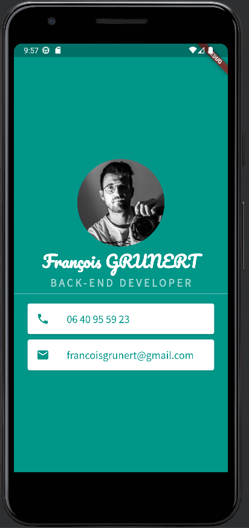

# My_card

Deuxième project Flutter pour m'entrainer en vue du stage de mai.

Application simple sous forme de carte de visite, permettant de mettre en place des images statiques et des polices d'écriture, ainsi que d'utiliser des widgets tels que :
- Scaffold
- SafeArea
- Center
- SizedBox
- Column
- CircleAvatar
- Text
- Divider
- Card
- ListTile

# Materiel

- Flutter
- Android Studio
- Tablette Lenovo M-10
- Android 10
- Emulateur Pixel 3a

# Ressources

- [Angela Yu](https://www.udemy.com/course/flutter-bootcamp-with-dart/)
- [Doc Flutter Widget](https://docs.flutter.dev/ui/widgets)
- [Icons](https://fonts.google.com/icons)
- [Police Source Sans Pro](https://fonts.google.com/specimen/Source+Sans+Pro?query=Source+)
- [Police Pacifico](https://fonts.google.com/specimen/Pacifico?query=Pacifico)

# Fichier principaux

- Code Flutter : [lib/main.dart](lib/main.dart)
- Configuration : [pubspec.yaml](pubspec.yaml)

# Example

